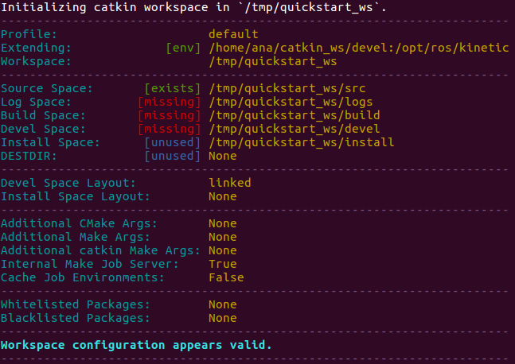
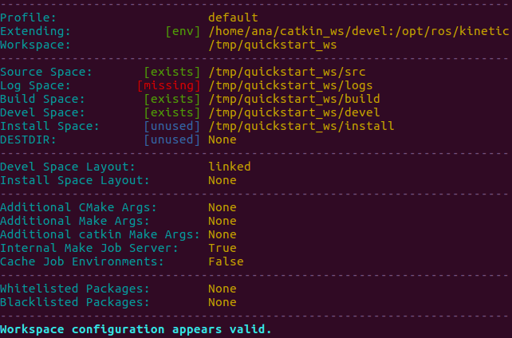

If you are getting started with robot control simulations, then you might be interested in using ROS alongside a robot simulator like Coppelia's V-REP.
ROS (Robot Operating System) is an open source framework for robot software development that allows a great number of executables to run in parallel and exchange data (synchronously or asynchronously). This is an essential capability needed when simulating or working with real robots since robot functionalities and tasks (e.g., localisation, object detection, grasping), can be defined as executables that interact with each other.

THe RosInterface is a plugin which interfaces ROS and V-REP allowing the user to write algorithms that are implemented on virtual robots. The interface was developed by Federico Ferri, and is part of the V-REP API framework.

The following tutorial walks you through the manual installation of this interface with ROS kinetic.


## 1. Install the required software
Before installing the interface you will need to make sure you have the follwing:
* ROS kinetic
* C++ compiler
* V-REP Stubs generator (v_repStubsGen)
    * Python interpreter (2.7 or greater)
    * lxml package for Python
    * tempita package for Python  
(Note: This tutorial assumes you already have a C++ compiler)


### a) Install ROS kinetic and the V-REP Stubs generator's required software
    
```shell 
$ sudo apt-get install -y ros-kinetic-desktop-full git cmake python-tempita python-catkin-tools python-lxml
```


### b) Now, install the V-REP Stubs generator

```shell 
$ cd /home/user/Software/vrep_ros_interface 

$ git clone -q https://github.com/fferri/v_repStubsGen.git
```

Check your installation: You should see v_repStubsGen listed by typing:
```shell 
$ ls
```

### c) Add its path to search path for importing python modules

```shell 
$ export PYTHONPATH=$PYTHONPATH:$PWD

$ echo $PYTHONPATH 
```

## 2. Create a temporary catkin workspace

```shell 
$ mkdir -p /tmp/quickstart_ws/src
```

## 3. Initialize this workspace

```shell
$ cd /tmp/quickstart_ws 

$ catkin init
```
You should see the following workspace configuration:

<figure>
	
</figure>


## 4. Clone & build the RosInterface in this workspace

```shell
$ cd src/

$ git clone https://github.com/fferri/v_repExtRosInterface.git vrep_ros_interface
```
You should see the vrep_ros_interface listed by typing:

```shell
$ ls
```

Now, build the workspace:
```shell
$ catkin build
```

Your workspace should now look like this:

<figure>
	
</figure>


## 5. Check that the resulting vrep-ros library is in the devel folder

```shell
$ cd ../devel/lib/
$ ls
```
You should see a library called "libv_repExtRosInterface.so"

## 6. Source the workspace

```shell
$ cd ..
$ cd ..
$ source devel/setup.bash
```

## 7. Copy the library in your V-REP installation folder

```shell
$ cp -iv devel/lib/libv_repExtRosInterface.so "$VREP_ROOT/"
```

Where  "VREP_ROOT" contains the path of your vrep installation folder. You can create this variable as follows:

* Add "VREP_ROOT" in bash:
    
    ```shell
    $ gedit ~/.bashrc &
    ```

* Add the following line at the end of the file:
    
    ```shell
    $ export VREP_ROOT="/home/user/Software/V-REP_PRO_EDU_V3_3_2_64_Linux/"
    ```

* Source the bash in the terminal:

    ```shell
    $  source ~/.bashrc 
    ```

* Check if the variable is working:
    
    ```shell
    $ echo $VREP_ROOT   
    ```


## 8. Run one of VREP’s simulation scenes/models

(Note: roscore should be running before you open V-REP)

* rosInterfaceTopicPublisherAndSubscriber.ttt 
* controlTypeExamples.ttt (focus on the bright red robot) 


