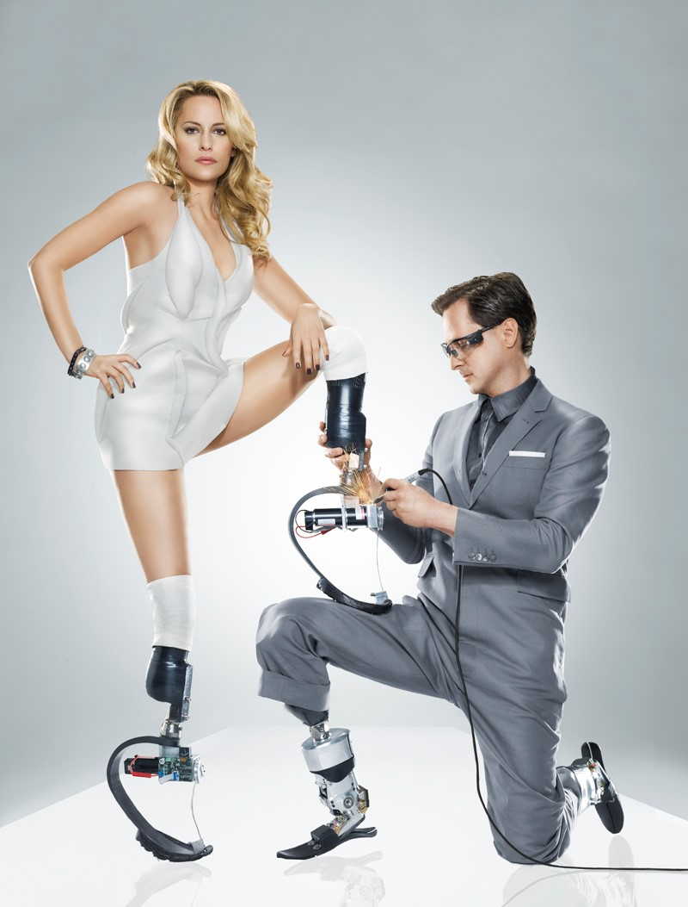
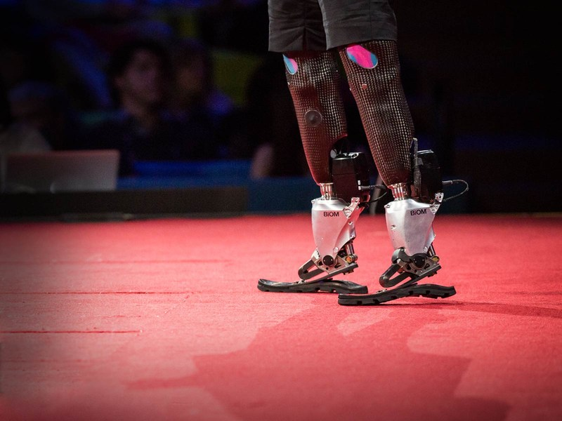
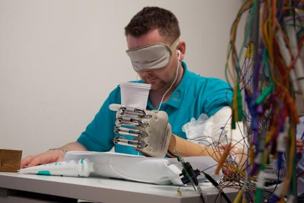
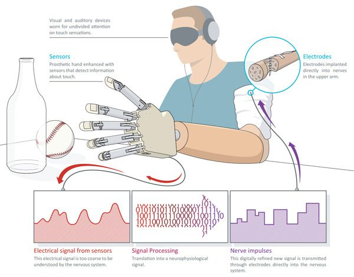
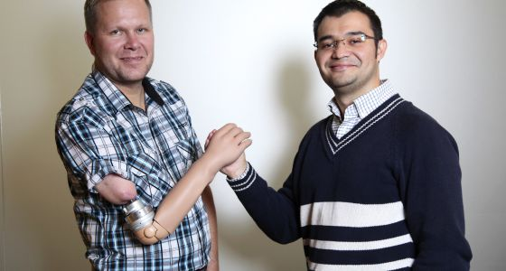
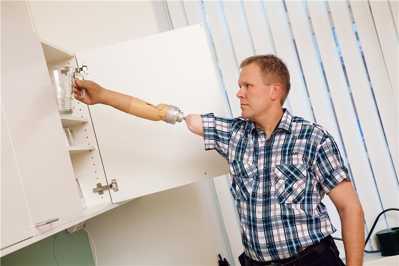
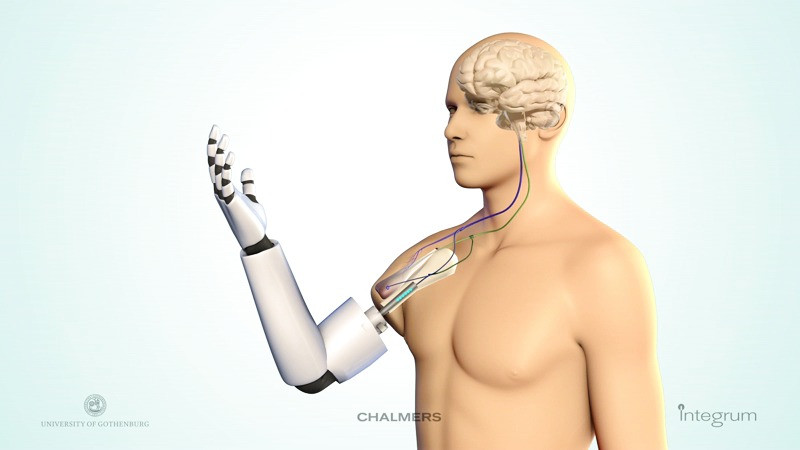

Humans are a natural wonder. A system of cleverly connected components able to sense and produce complex, fluent, and yet, intuitive motions. Decades of research have been devoted to unraveling the secrets behind human motion generation. Such knowledge is commonly known as fundamental in fields like medicine, neuroscience, sports science, and psychology. However, nowadays, it is also becoming the “holy grail” in what may seem a sci-fi pursuit: the age of the machine man.

Machine man, bionic man, cyborgs … If you are a Star Wars or Asimov fan, these terms probably ring a bell. Can you picture Luke Skywalker and his artificial hand?  Darth Vader’s suit containing life-support systems? Or Asimov’s Bicentennial man, Andrew Martin? A robot with a positronic (artificial) brain and organic prosthetics.
In many ways, sci-fi writers and directors triggered, what I like to call, the age of the machine man. The age where humans and robots are becoming closer than ever. The age where the human body is being repaired and even enhanced, thanks to the integration of robotic devices.
But, how far or close are we from creating a Luke Skywalker, a Darth Vader, or an Andrew Martin? The truth is, science is not there yet, but it is definitely on its way.

Researchers and engineers from all over the world are working tirelessly on the quest for a working machine man. Such journey implies answering three important questions:
How to design functional bionic (robotic) limbs? How to connect them to the human body? And how to control them with our brains?

One of the most inspiring people working on the design of bionic limbs is MIT Professor [Hugh Herr](https://www.media.mit.edu/people/hherr/overview/). His work and words speak loudly of the potential of a human-machine integration. As he stated in a recent [TED talk](https://www.ted.com/talks/hugh_herr_the_new_bionics_that_let_us_run_climb_and_dance/transcript?language=en#t-499854), “Humans are not disabled. A person can never be broken. Our built environment, our technologies, are broken and disabled. We the people need not accept our limitations, but can transcend disability through technological innovation.” Hugh Herr is truly transcending disabilities. You see, he, himself, is a machine man.

<figure>
	
	<figcaption> Hugh Herr on the cover of Wired magazine with American athlete Amy Mullins. </figcaption>
</figure>

Before becoming mechanical engineer and biophysicist, he was one of the best rock climbers in the U.S. However, while ascending Mount Washington in New Hampshire, Herr and his partner got lost and endured three nights at freezing temperatures. Herr lost both of his legs to severe frostbite.
Today, he wears bionic limbs that perform better that his biological legs. He has created narrow-edged feet capable of climbing rock fixtures where the human foot cannot penetrate, spiked feet for climbing vertical ice walls, and most importantly bionic lower leg limbs. His [BiOM Ankle system](http://www.bionxmed.com/payer/the-biom-advantage/) is the world’s first bionic lower leg and also the first prosthesis allowing its users to achieve normal walking speeds and energy expenditure levels. This system is composed of mechanical components (representing the skeleton and muscles), electrical components (allowing the communication of the biological and bionic body), sensors placed on key places on the amputated limb (to sense the user’s motion intention), and finally, computer chips (to control the bionic limb according to the user’s intention).

<figure class="half">
	
	
	<figcaption> (Left) Hugh Herr climbing with prosthetic legs. (Right) Hugh Herr wearing the BiOM Ankle system at his TED talk. </figcaption>
</figure>

Bionic limbs that move like flesh and bone. Mind blowing right? But what about, bionic limbs that actually “feel” like flesh and bone?.
Researchers in Switzerland and Italy have been working on establishing a two-way communication between bionic limbs and the biological body. Two-way, meaning that the biological body can send commands to the bionic limbs and these, in turn, can send sensations to the biological body. And no, this is not an Asimov or Star Wars story, this is the work of Prof. [Silvestro Micera](http://cnp.epfl.ch/Miceralab) and his team at the [EPFL Center for Neuroprosthetics](http://cnp.epfl.ch/) (Switzerland) and [SSSA](https://www.santannapisa.it/en) (Italy). This team created a [sensory feedback](https://actu.epfl.ch/news/amputee-feels-in-real-time-with-bionic-hand/) that allows amputees to feel the objects they grasp with their bionic hand. Amputees can feel the hardness or softness of objects and even their shapes. 

<figure>
	
	<figcaption> Dennis Aabo Sørensen was the amputee selected to try this novel bionic hand. Here we can see him grasping and identifying objects while blindfolded. He is the first amputee in the world to feel a rich amount of sensory information through a bionic hand (Photo courtesy of LifeHand 2 / Patrizia Tocci). </figcaption>
</figure>
 
To produce this feedback, first, sensors on the bionic hand measure the level of force exerted on the object. Then, this force is transformed into an electrical current that is sent to electrodes implanted on the user’s nerves. Finally, the transmission of this information restores the sense of hand touch in the nervous system.
This solution might seem straightforward. However, a considerable amount of work is devoted to the transformation of the user’s grasping forces into a signal that is understandable by the nervous system. Thus, one of the main contributions of this work is the development of computer algorithms able to make this interpretation.

<figure>
	
	<figcaption> Diagram explaining the bionic hand's sensory feedback. First, data is collected from the hand's sensors, then, it is processed to extract the relevant information only. Finally, specialized computer algorithms transform this information into impulses which the nervous system can understand. </figcaption>
</figure>

Another important aspect of bionic limbs is how they communicate with the human body. This communication is essential to ensure the transmission of the right instructions and sensations. To achieve this, there is a need for an intimate physical integration between man and machine.
Such an integration implies an internal and long-lasting connection between the bionic limb’s circuitry and mechanical components and the human skeletal and nervous system.
Fortunately, researchers at [Chalmers University of Technology](http://www.chalmers.se/en/Pages/default.aspx), in Sweden, are making giant steps in this area with the creation of a [bionic arm](https://www.chalmers.se/en/news/Pages/Mind-controlled-prosthetic-arms-that-work-in-daily-life-are-now-a-reality.aspx) that is directly connected to the user’s bones, nerves, and muscles. 

<figure class="half">
	
	
	<figcaption> (Left) Magnus Niska (wearing the bionic arm) and Max Ortiz Catalán. (Right) Magnus Niska performing everyday tasks thanks to the bionic arm. </figcaption>
</figure>

As stated by [Max Ortiz Catalán](http://www.chalmers.se/en/staff/Pages/max-jair-ortiz-catalan.aspx), the team’s lead research scientist, this project achieved a stable fusion between man and machine by integrating them at different levels. At the skeletal level, this integration was made through “osseointegration”, a technology allowing the connection of the living bone to the artificial arm. While at the nervous and muscular level, the integration was possible thanks to neuromuscular electrodes, sensors which connect the bionic arm’s control system to the user’s nerves and muscles.  A few scientists have achieved an internal integration at this level. However, this work is a breakthrough due to its demonstrated stable and long-term use by an amputee (over a year).

<figure>
	
	<figcaption> Diagram depicting the integration of the bionic arm into the user's bone and the electrodes attached to his remaining muscles and nerves. Note that although the electrodes remain within the body, the bionic arm can be detached from the body at anytime. </figcaption>
</figure>

Bionic limbs that can be controlled with the mind? That can be used to feel? And that can be integrated into our bodies?
These are just a few examples of today’s global efforts to overcome disability via technological innovation. And although the fictional ambiance surrounding bionic devices could lead you to think that they are constrained to labs and clinics, you should know that thousands of people are being equipped with them.
Bionics has given amputees the ability to walk, run, jump, climb, dance, grasp, and even feel. The success of this devices is not only being celebrated and challenged in “everyday life” but also in athletic arenas, such as ETH Zurich’s [Cybathlon](http://www.cybathlon.ethz.ch/). An event where athletes with disabilities or physical weaknesses compete against each other using state-of-the-art robotic technology.

So, how far are we from making Asimov’s or George Lucas’ fantasies a reality? Bionics research is clearly gaining momentum, and as Hugh Herr said: “Someday soon, these kinds of devices will be no more unusual than a pair of glasses.” Until then, let’s embrace the beginning of the age of the machine man.