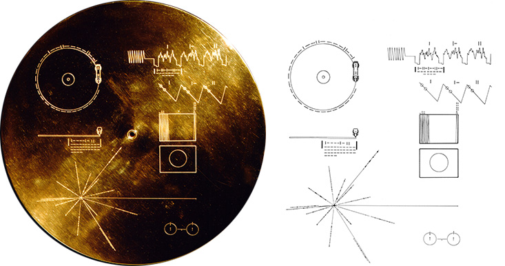

*“Exploration is in our nature. We began as wanderers, and we are wanderers still. We have lingered long enough on the shores of the cosmic ocean. We are ready at last to set sail for the stars.” - Carl Sagan*

In the 1970s mankind took a leap into the mysterious and marvelous depths of the cosmic ocean we call “universe” with the [Voyager](https://voyager.jpl.nasa.gov/) program and a Grand Tour of the solar system. The voyager spacecrafts were designed to go where no other man-made object had ever gone before, carrying a little bit of our humanity at their core.

The spacecrafts’ planetary mission was to explore our solar system’s gas giants: Jupiter, Saturn, Uranus and Neptune in one single trip. A once-in-several lifetimes opportunity thanks to a convenient planet alignment that occurs once every 175 years. Such an alignment, would make it possible to sling shot the spacecrafts past each planet thanks to their gravitational assist. And so, the voyagers launched in 1977 with different trajectories. Voyager 2 launched first, taking a longer route which would allow it to visit Jupiter and Saturn, and become the first spacecraft to visit the ice giants, Uranus and Neptune. Voyager 1 launched some days after its twin, with the objective of visiting Jupiter, Saturn, and Saturn's largest moon, Titan.

<figure>
	
	<figcaption> Artist's concept of the Voyager spacecraft in space. Credits: NASA. </figcaption>
</figure>

<figure>
	
	<figcaption> Voyager 1 and 2 distinct trajectories through the solar system. Credits: NASA. </figcaption>
</figure>

Today, the voyagers have completed their planetary missions giving us data and never before seen images that have made us discover, wonder and admire our cosmic ocean and its particles. Through their eyes, we realized that Jupiter’s great red spot is actually a complex storm moving in a counterclockwise direction, that volcanism can be observed in other bodies of the solar system (such as in Jupiter's moon Io, which has 100 times the volcanic activity of Earth).  Through their eyes, we saw some of Saturn’s moons and rings for the first time, we got the first and only close-up look at Uranus and Neptune (their rings and moons), we witnessed how the winds in Neptune blow faster than anywhere else in the solar system, and how its most massive moon orbits backwards from all other large moons in the solar system.

<figure class="half">
	
	
	<figcaption> (Left) This time-lapse video records Voyager 1's approach to Jupiter with a focus on its great red spot. Credits: NASA/JPL-Caltech. (Right) Saturn, its rings and moons. The high-resolution data taken from the voyagers changed many of our initial perceptions of this planet. Credits: NASA/JPL-Caltech
 </figcaption>
</figure>

<figure>
	
	
	<figcaption> (Left) Uranus true-color and false-color views, its ring system and moons. Credits: NASA/JPL-Caltech. (Right) Voyager 2's approach to Neptune. Credits: NASA/JPL-Caltech
 </figcaption>
</figure>

With a last look at our solar system the planetary missions were over, but something even more exciting was about to begin: the interstellar missions. The word interstellar literally means “the space between the stars”, but its true definition is a bit more complex (otherwise all space would be interstellar).  Imagine a big bubble enclosing the sun. The sun is powerful inside this bubble, its solar wind and gravitational pull directly affect everything in it (planets, comets, moons). Outside this bubble, the sun’s influence wanes and we find …  interstellar space.

Voyager 1 entered interstellar space in 2012 (making it humanity’s farthest spacecraft/object) and Voyager 2 is expected to do the same sometime around 2019 - 2020. As they enter the darkness of interstellar space, both voyagers continue to be our eyes and ears, unveiling the workings at the edge of our home and beyond. And although they have limited power and will eventually shut down within the next decade, the voyagers will continue to wander the milky way (perhaps eternally) carrying a piece of all us within them: a  golden record. The golden records were designed and sent on this interstellar mission with one main objective: a message, a first introduction, a portrait of life on earth for other possible intelligent life forms in the cosmos.

*"This is a present from a small, distant world, a token of our sounds, our science, our images, our music, our thoughts and our feelings. We are attempting to survive our time so we may live into yours." - President Jimmy Carter*

Each golden phonograph record contains [images](https://voyager.jpl.nasa.gov/galleries/images-on-the-golden-record/) and [sounds](https://voyager.jpl.nasa.gov/golden-record/whats-on-the-record/sounds/) from Earth selected by the legendary [Carl Sagan](http://www.planetary.org/about/our-founders/carl-sagan.html). The sounds range from thunder and birds, to Bach concertos,  Peruvian panpipes, and spoken greetings from Earth-people in fifty-five languages. The images depict the planets in our solar system, Earth, the DNA structure, mathematical definitions, a women feeding a child, people eating and drinking, snowflakes, sand dunes, a dancer from Bali, a sunset and many other earthly views. The record’s emblematic [cover](https://voyager.jpl.nasa.gov/golden-record/golden-record-cover/) contains indications on how to play it, how to decode its images, and the location of our solar system with respect to 14 [pulsars](https://www.space.com/32661-pulsars.html) (“flickering stars” in the night sky, which are actually the remains of “dying stars” that rotate while emitting steady beams of light).

<figure>
	
	<figcaption> The Golden Record cover shown with its extraterrestrial instructions (the pulsar map is represented on the bottom left of the disk by intersecting lines). Credit: NASA/JPL. </figcaption>
</figure>

*"The spacecraft will be encountered and the record played only if there are advanced space-faring civilizations in interstellar space, but the launching of this 'bottle' into the cosmic 'ocean' says something very hopeful about life on this planet." - Carl Sagan*

In the universe, the space between the stars is immense. So immense, that it will take Voyager 1 40,000 years to pass near another star ([Gliese 445](https://www.nasa.gov/mission_pages/voyager/multimedia/pia17461.html#.W4F_Vhy-k8o)). However, even if the Voyagers wander eternally along the Milky Way, one day, these “time capsules” might become the only evidence that mankind ever existed. If we don’t find a new home in the cosmos within the next couple of billion years, the human race will cease to exist. In about 5 billion years, the sun will grow so large that Earth will receive as much sunlight as Venus receives today, wiping out life as we know it. That is, if *we* do not destroy Earth first. Our careless consumption of resources, our refusal to look down from our privileged place in the world, our indifference towards the conflicts that those privileges entail for the majority of Earth’s human population, other species and the environment, one day might destroy the only home we’ve ever known. And so, the Voyagers and their golden records could become the reminiscence of a “pale blue dot”. A beautiful place that hosted a rich diversity of life forms, among them humans, who decided to sail for the stars while neglecting their port of departure ... that "pale blue dot".

*"Look again at that dot. That's here. That's home. That's us. On it everyone you love, everyone you know, everyone you ever heard of, every human being who ever was, lived out their lives. The aggregate of our joy and suffering, thousands of confident religions, ideologies, and economic doctrines, every hunter and forager, every hero and coward, every creator and destroyer of civilization, every king and peasant, every young couple in love, every mother and father, hopeful child, inventor and explorer, every teacher of morals, every corrupt politician, every "superstar," every "supreme leader," every saint and sinner in the history of our species lived there--on a mote of dust suspended in a sunbeam." - Carl Sagan, [Pale Blue Dot](http://www.planetary.org/explore/space-topics/earth/pale-blue-dot.html), 1994*

<figure class="half">
    
	
	<figcaption> (Left) Carl Sagan portrayed in Jacqueline Rae's "Glorious Dawn". (Right) The Pale Blue Dot is an iconic picture of Earth taken from Voyager 1 from a record distance of almost 4 billion miles. At the request of Carl Sagan, Voyager 1 turned around to take one last look at our home. Earth can be seen as a dot halfway along the orange ray of light on the right. Credit: NASA. </figcaption>
</figure>

Further information:

- An excerpt from Carl Sagan's "Pale blue dot" book and some of his thoughts on the voyagers' future:
<iframe width="560" height="315" src="https://www.youtube.com/embed/EPXYUR5TqAQ" frameborder="0"></iframe>

- "The Farthest", a documentary about the Voyager mission.
- <iframe width="560" height="315" src="https://www.youtube.com/embed/xYKoRbGXPIA" frameborder="0" allowfullscreen></iframe>

